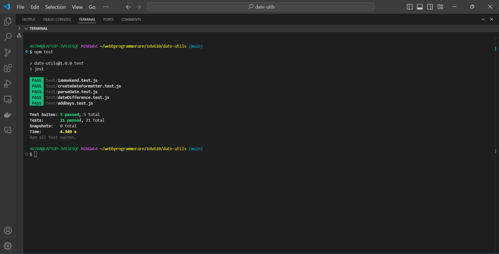

# Test Report

## Summary

This document summarizes the tests performed on the Date Utils module. The module was tested using automatic unit tests with the Jest framework. Each function in the module was tested for various scenarios, including valid and invalid inputs. The tests were run automatically, and the results were observed and compared to the expected outcomes.

## How to Run Tests

1. **Install dependencies**: Run `npm install` to install the necessary dependencies.
2. **Run tests**: Execute `npm test` to run all the tests using Jest.

## Test Results Screenshot

