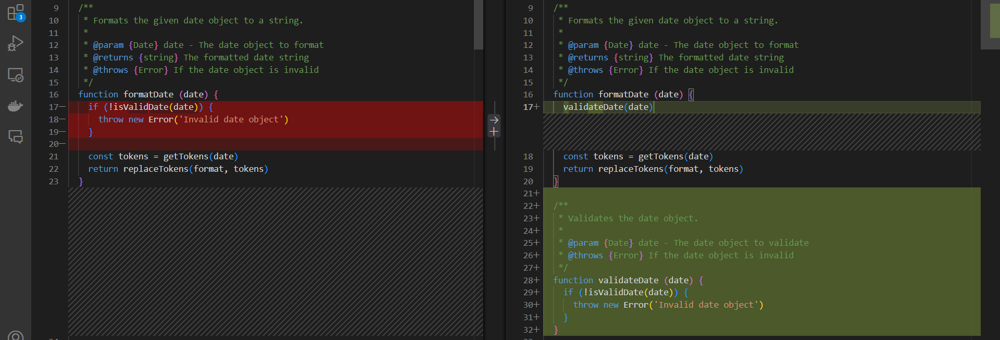
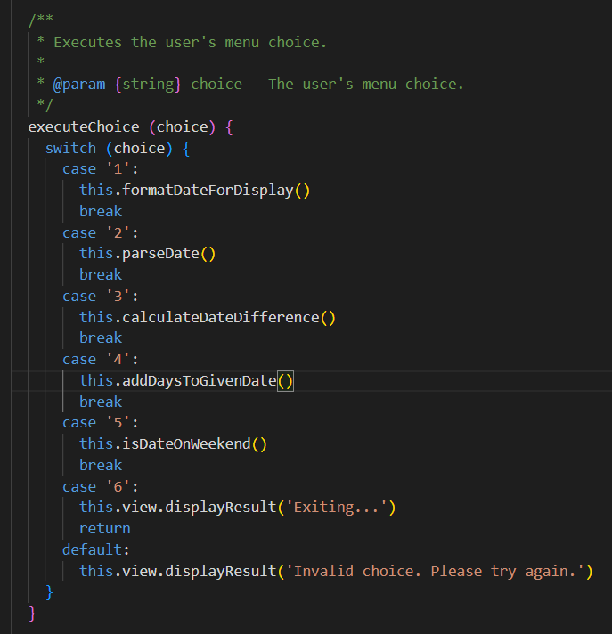
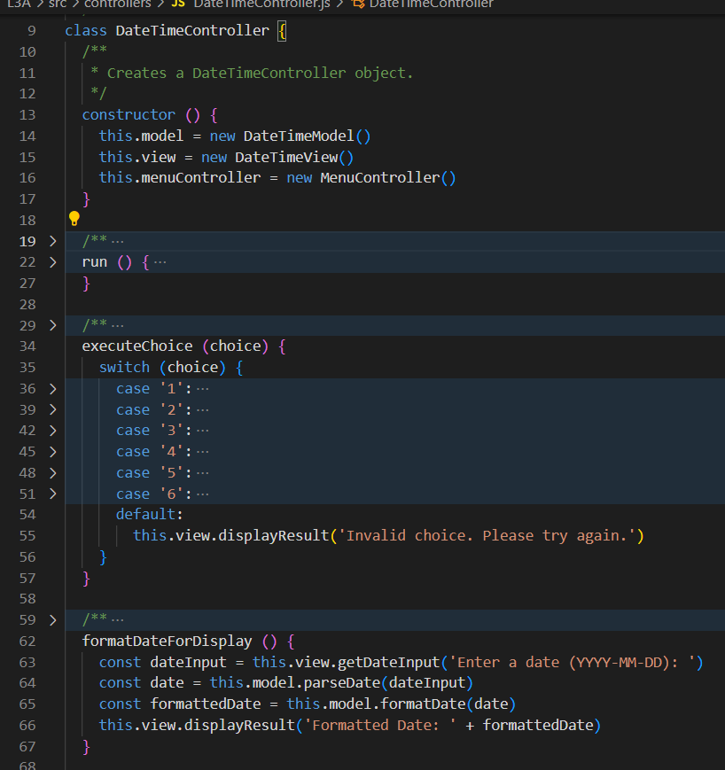
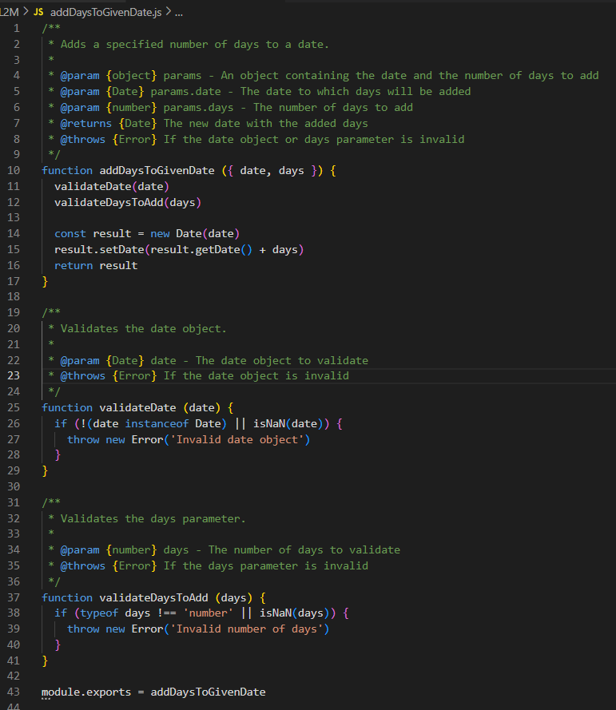
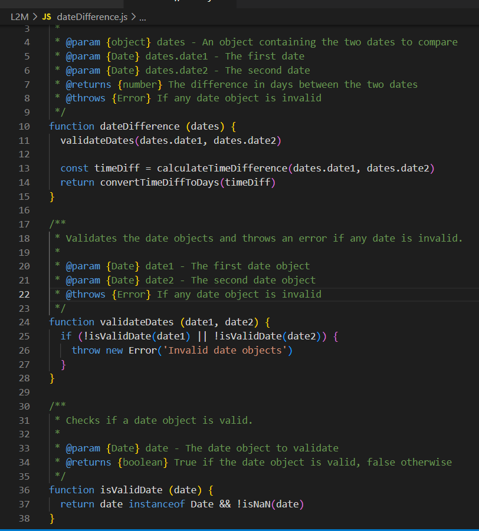
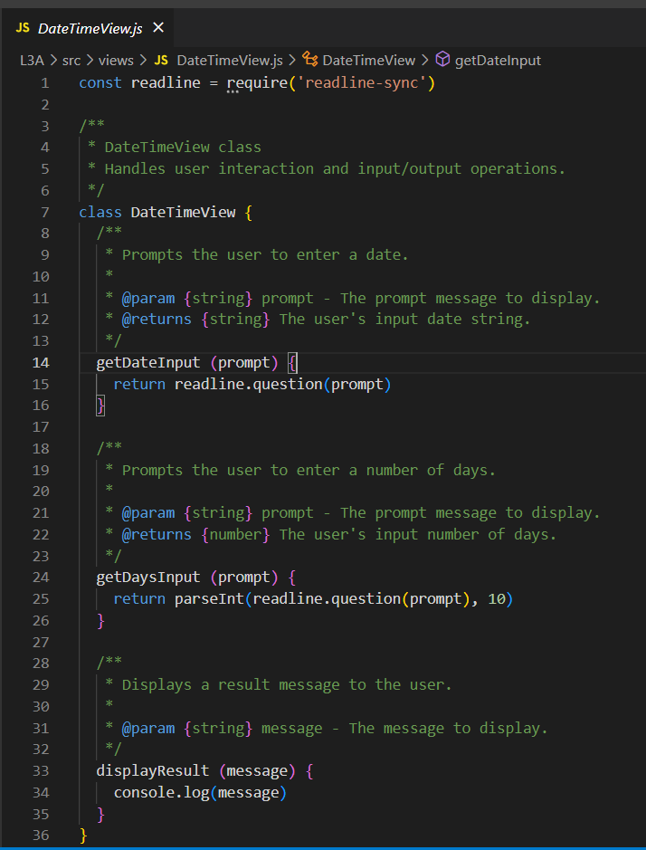

# Reflection

## Chapter 2: Meaningful Names
Chapter 2 of *Clean Code* emphasizes the importance of meaningful and expressive names, which has significantly influenced my approach to naming functions and variables. For example, I revised `addDays()` to `addDaysToGivenDate()` and `validateDays()` to `validateDaysToAdd()`. These changes make the purpose of each function more explicit, improving readability and ensuring the code conveys its intent more effectively. Previously, some function names were too generic, causing confusion about their specific purpose. By following the chapter’s guidelines, I’ve made my code more intuitive and maintainable for others. Here is a screenshot of the improved code for clarity:

## Chapter 3: Functions
Chapter 3 focuses on writing small, focused functions that do one thing well. I noticed that some of my functions, like `formatDate()`, handled multiple tasks (e.g., validation, token replacement). Following this chapter, I refactored `formatDate()` by moving the validation logic to a separate function, `isValidDate()`. Additionally, I created a `MenuController` class to handle menu choices, separating this responsibility from the `DateTimeController`. These changes improved the Single Responsibility Principle, making the code easier to maintain and extend. By keeping functions small and well-named, the code has become more modular and testable.
However, I chose to use a `switch` statement in the `DateTimeController` to handle user menu choices. While this conflicts with the principle of avoiding `switch` statements for better code quality, I preferred it for several reasons: it provides a clear and straightforward way to handle multiple discrete choices, the number of menu options is small and unlikely to change frequently, and it allows for a simple and direct mapping of user input to actions. Here is a screenshot of the current implementation for clarity:

## Chapter 4: Comments
Chapter 4 of *Clean Code* emphasizes the importance of writing clear and meaningful comments. This chapter has influenced me to ensure that my comments explain the "why" behind the code rather than the "what". For instance, in the `dateDifference` function, I added comments to explain the purpose of each parameter and the reason for validation checks. This approach has made my code more understandable and maintainable. Additionally, I focused on avoiding redundant comments that merely restate the code. Here is a screenshot of the improved comments for clarity:

## Chapter 5: Formatting
Chapter 5 of *Clean Code* emphasizes the importance of proper formatting to improve readability and maintainability. This chapter has influenced me to ensure consistent indentation, spacing, and naming conventions throughout my code. For example, in the `DateTimeController` class, I maintained consistent vertical and horizontal density, making the code easier to read. Additionally, I ensured that functions are short and focused on a single task, which aligns with the principles discussed in the chapter. Here is a screenshot of the well-formatted code for clarity:

## Chapter 6: Objects and Data Structures
Chapter 6 of *Clean Code* emphasizes the importance of using objects and data structures appropriately. This chapter has influenced me to ensure that my code encapsulates responsibilities and follows the Law of Demeter. For example, in the `DateTimeController` class, I encapsulated the interaction between the model and the view, ensuring that it only interacts with its immediate dependencies. Similarly, the `DateTimeModel`, `DateTimeView`, and `MenuController` classes encapsulate their respective responsibilities, making the code easier to maintain and extend. Additionally, in the `addDaysToGivenDate` function, I encapsulated the logic for adding days to a date and used validation functions to ensure the integrity of the input data. Here is a screenshot of the well-encapsulated code for clarity:

## Chapter 7: Error Handling
Chapter 7 of *Clean Code* emphasizes the importance of proper error handling. This chapter has influenced me to use exceptions rather than return codes to handle error conditions. For example, in the `dateDifference` function, I use exceptions to handle invalid date parameters, providing descriptive error messages for context. Similarly, the `createDateFormatter`, `addDaysToGivenDate`, and `isWeekend` functions use exceptions to handle error conditions. Here is a screenshot of the well-encapsulated error handling code for clarity:

## Chapter 8: Boundaries
Chapter 8 of *Clean Code* emphasizes the importance of managing boundaries in software systems. This chapter has influenced me to encapsulate interactions with third-party libraries and provide clear interfaces for different operations. For example, in the `DateTimeView` and `MenuController` classes, I encapsulated the interaction with the `readline-sync` library, isolating it from the rest of the application. Similarly, the `DateTimeController` class encapsulates the interaction between the model and the view, ensuring that changes in one do not directly affect the other. The `DateTimeModel` class encapsulates various date-time utility functions, providing a clear interface for different operations. Here is a screenshot of the well-encapsulated code for clarity:

## Chapter 9: Unit Tests
*Your reflections on Chapter 9 here.*

## Chapter 10: Classes
*Your reflections on Chapter 10 here.*

## Chapter 11: Systems
*Your reflections on Chapter 11 here.*
