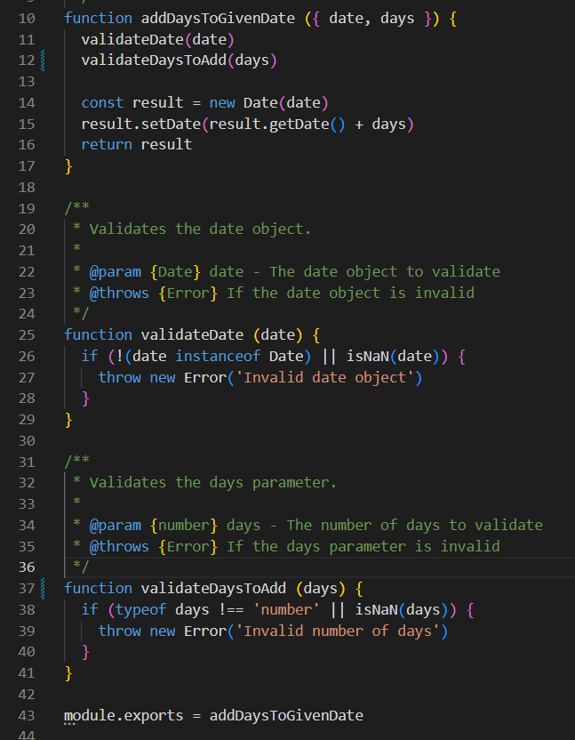
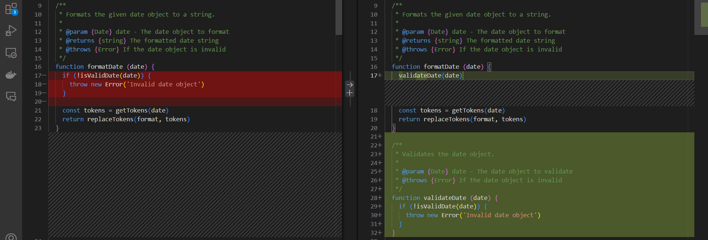
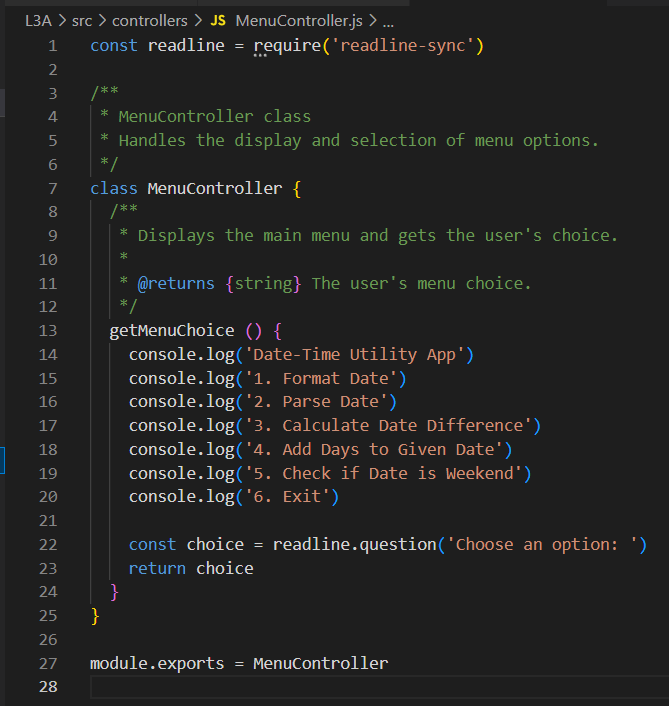
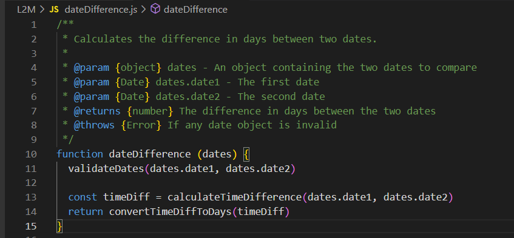
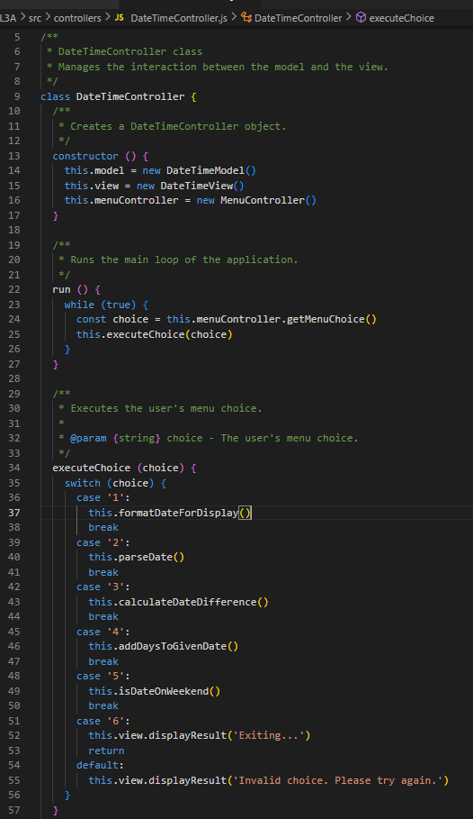

# Reflection

## Chapter 2: Meaningful Names
Chapter 2 of *Clean Code* emphasizes the importance of meaningful and expressive names, which has significantly influenced my approach to naming functions and variables. For example, I revised `addDays()` to `addDaysToGivenDate()` and `validateDays()` to `validateDaysToAdd()`. These changes make the purpose of each function more explicit, improving readability and ensuring the code conveys its intent more effectively. Previously, some function names were too generic, causing confusion about their specific purpose. By following the chapter’s guidelines, I’ve made my code more intuitive and maintainable for others. Here is a screenshot of the improved code for clarity:

## Chapter 3: Functions
Chapter 3 focuses on writing small, focused functions that do one thing well. I noticed that some of my functions, like `formatDate()`, handled multiple tasks (e.g., validation, token replacement). Following this chapter, I refactored `formatDate()` by moving the validation logic to a separate function, `isValidDate()`. Additionally, I created a `MenuController` class to handle menu choices, separating this responsibility from the `DateTimeController`. These changes improved the Single Responsibility Principle, making the code easier to maintain and extend. By keeping functions small and well-named, the code has become more modular and testable. Here is a screenshot of the refactored code for clarity:

## Chapter 4: Comments
Chapter 4 of *Clean Code* emphasizes the importance of writing clear and meaningful comments. This chapter has influenced me to ensure that my comments explain the "why" behind the code rather than the "what". For instance, in the `dateDifference` function, I added comments to explain the purpose of each parameter and the reason for validation checks. This approach has made my code more understandable and maintainable. Additionally, I focused on avoiding redundant comments that merely restate the code. Here is a screenshot of the improved comments for clarity:

## Chapter 5: Formatting
Chapter 5 of *Clean Code* emphasizes the importance of proper formatting to improve readability and maintainability. This chapter has influenced me to ensure consistent indentation, spacing, and naming conventions throughout my code. For example, in the `DateTimeController` class, I maintained consistent vertical and horizontal density, making the code easier to read. Additionally, I ensured that functions are short and focused on a single task, which aligns with the principles discussed in the chapter. Here is a screenshot of the well-formatted code for clarity:

## Chapter 6: Objects and Data Structures
*Your reflections on Chapter 6 here.*

## Chapter 7: Error Handling
*Your reflections on Chapter 7 here.*

## Chapter 8: Boundaries
*Your reflections on Chapter 8 here.*

## Chapter 9: Unit Tests
*Your reflections on Chapter 9 here.*

## Chapter 10: Classes
*Your reflections on Chapter 10 here.*

## Chapter 11: Systems
*Your reflections on Chapter 11 here.*
