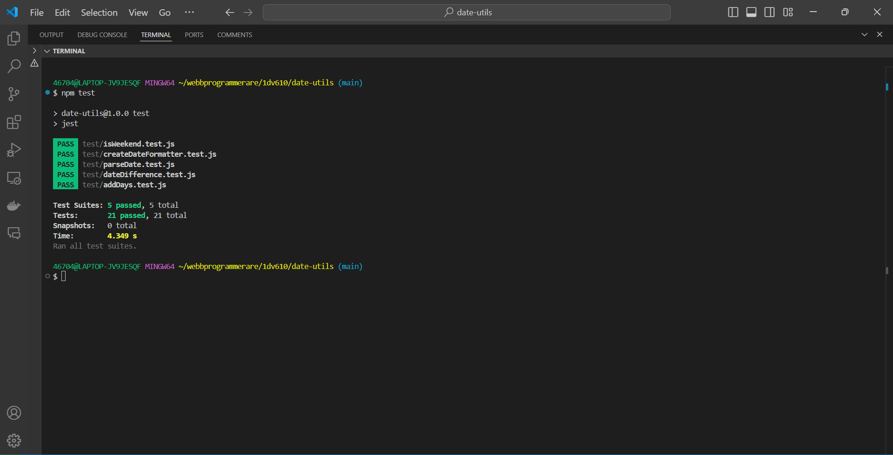

# Test Report

## Summary

This document summarizes the tests performed on the Date Utils module. The module was tested using automatic unit tests with the Jest framework. Each function in the module was tested for various scenarios, including valid and invalid inputs. The tests were run automatically, and the results were observed and compared to the expected outcomes.

## How to Run Tests

1. **Install dependencies**: Run `npm install` to install the necessary dependencies.
2. **Run tests**: Execute `npm test` to run all the tests using Jest.

## Test Results

| What was tested                          | How it was tested                                                                    | Test results |
|------------------------------------------|--------------------------------------------------------------------------------------|--------------|
| parseDate - valid date string            | Parsed a valid date string and compared the output to the expected Date object       | Passed       |
| parseDate - invalid date string format   | Parsed invalid date strings and checked for thrown errors                            | Passed       |
| parseDate - valid year component         | Parsed a date string with a valid year component and compared to expected output     | Passed       |
| parseDate - valid month component        | Parsed a date string with a valid month component and compared to expected output    | Passed       |
| parseDate - valid day component          | Parsed a date string with a valid day component and compared to expected output      | Passed       |

| addDays - valid date and days            | Added days to a valid date and compared the output to the expected Date object       | Passed       |
| addDays - invalid date                   | Added days to an invalid date and checked for thrown errors                          | Passed       |
| addDays - invalid number of days         | Added an invalid number of days to a valid date and checked for thrown errors        | Passed       |
| addDays - NaN number of days             | Added `NaN` as the number of days to a valid date and checked for thrown errors      | Passed       |
| addDays - NaN date                       | Added days to a `NaN` date and checked for thrown errors                             | Passed       |

| createDateFormatter - valid date         | Formatted a valid date and compared the output to the expected formatted string      | Passed       |
| createDateFormatter - invalid date object| Formatted an invalid date object and checked for thrown errors                       | Passed       |
| createDateFormatter - NaN date           | Formatted a `NaN` date and checked for thrown errors                                 | Passed       |

| dateDifference - valid dates             | Calculated the difference between two valid dates and compared to expected output    | Passed       |
| dateDifference - invalid date objects    | Calculated the difference between invalid date objects and checked for thrown errors | Passed       |
| dateDifference - NaN date objects        | Calculated the difference between `NaN` date objects and checked for thrown errors   | Passed       |

| isWeekend - Saturday                     | Checked if a Saturday is a weekend and compared to expected output                   | Passed       |
| isWeekend - Sunday                       | Checked if a Sunday is a weekend and compared to expected output                     | Passed       |
| isWeekend - weekday                      | Checked if a weekday is not a weekend and compared to expected output                | Passed       |
| isWeekend - invalid date object          | Checked if an invalid date object throws an error                                    | Passed       |
| isWeekend - non-date object              | Checked if a non-date object throws an error                                         | Passed       |

## Test Results Screenshot

